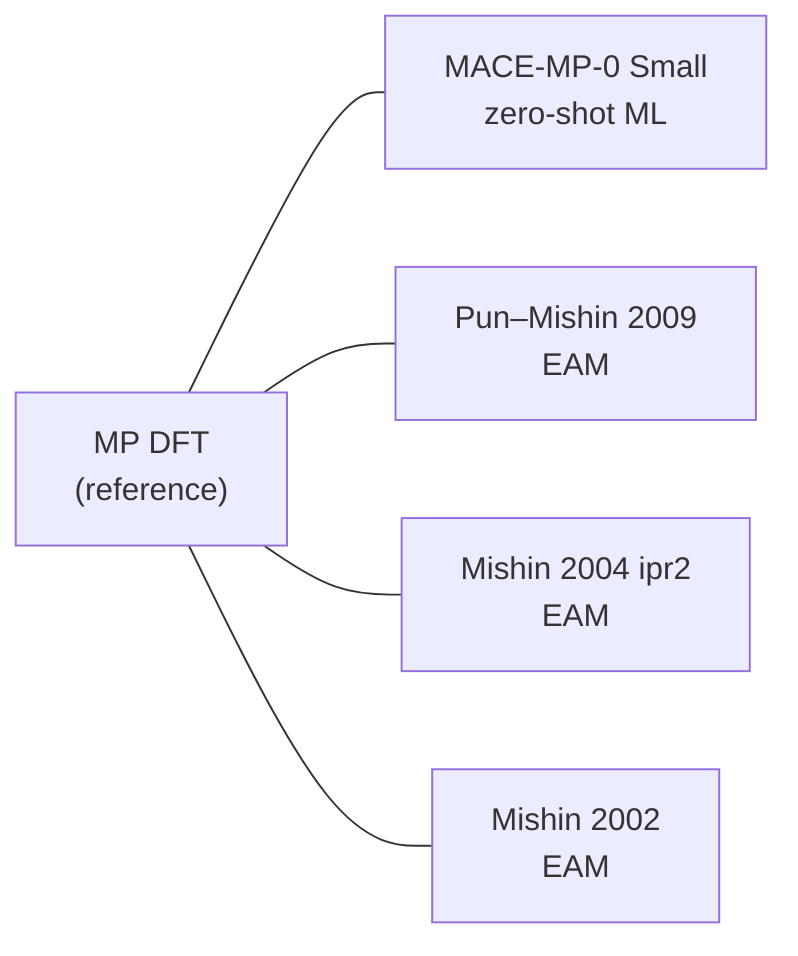

# Show_Case — Ni–Al Interatomic Potentials: What Was Calculated, Why, and What It Showed

A complete walkthrough of the scientific content of this project: the structures, the
calculations, the numbers they produced, the model comparisons, and the reasoning
behind every selection. Environment and repository setup are deliberately omitted.

**Bottom line:** a universal pretrained MACE foundation model, used *zero-shot* with no
Ni–Al fine-tuning, predicted Ni–Al formation energies **3.8× more accurately than the best
purpose-built classical Ni–Al EAM potential** (MAE 0.0309 vs 0.1173 eV/atom against
Materials Project DFT), and was the only method of the four tested that reproduced the
DFT stability ranking of the five phases exactly.

---

## Documentation audit and authoritative record

This presentation was reconciled with the generated project artifacts on 2026-08-19. No calculation was rerun for the documentation audit. Companion documents: [README.md](README.md) for the project overview and repository layout, [RESULTS_SUMMARY.md](RESULTS_SUMMARY.md) for the complete calculation tables, exact input systems, execution settings, and source paths, and [docs/RESEARCH_LOG.md](docs/RESEARCH_LOG.md) for the chronological working log.

| Role | Item actually used |
|---|---|
| Main ML model | **MACE-MP-0 Small**, pretrained and used zero-shot on CPU; no project-specific fine-tuning |
| Classical models | Purja Pun-Mishin 2009 Ni-Al EAM; Mishin 2004 Ni-Al EAM (ipr2); Mishin-Mehl-Papaconstantopoulos 2002 B2-NiAl EAM |
| Calculation engines | ASE for MACE workflows; LAMMPS `22 Jul 2025 - Update 4` for the EAM workflows |
| Systems | Pure Al and Ni references plus Al3Ni, Al3Ni2, AlNi, Al3Ni5, and AlNi3 |
| External benchmark | Materials Project processed DFT-derived values, database version `2026.04.13` |

The LAMMPS study completed 63 of 63 planned states (three potentials x seven systems x three states) without failure. MACE CPU calculations used float64 and disabled dispersion for Steps 5-8; the initial FCC-Al software check used float32.

The numerical conclusions in this document are limited to the tested static bulk sample. Statements that connect observed trends to mechanisms such as magnetism, model form, or fitting history are interpretations rather than independently proven causal results. The directly established fact is that the structural MACE workflow has no user-controlled spin or magnetic-moment input, so Ni magnetic-state sensitivity remains a caveat.

## 1. The scientific question

> Can a universal pretrained MACE model give accurate and physically reliable predictions
> for Ni–Al alloy structures — and does it actually need fine-tuning?

The project answers this by building a chain in which every link is independently
verifiable, and refuses to compare quantities that live on incompatible energy scales.
That constraint drives most of the design decisions below.

## 2. The material system, and why these seven structures

Ni–Al is the classic aerospace superalloy system. The five intermetallic line compounds
span the whole composition range, which is exactly what is needed to test whether a
potential is *transferable* rather than tuned to one stoichiometry.

| Phase | MP ID | Atoms/cell | Space group | x(Ni) | Structural role |
|---|---|---:|---|---:|---|
| Al₃Ni | mp-622209 | 16 | Pnma (62) | 0.250 | Al-rich, low symmetry, orthorhombic — hardest case |
| Al₃Ni₂ | mp-1057 | 5 | P-3m1 (164) | 0.400 | Trigonal, intermediate |
| AlNi | mp-1487 | 2 | Pm-3m (221) | 0.500 | **B2** — the classic ordered phase |
| Al₃Ni₅ | mp-16514 | 8 | Cmmm (65) | 0.625 | Ni-rich orthorhombic |
| AlNi₃ | mp-2593 | 4 | Pm-3m (221) | 0.750 | **L1₂ (γ′)** — the superalloy strengthening phase |
| Al (ref) | mp-134 | 1 | Fm-3m (225) | — | Elemental chemical potential |
| Ni (ref) | mp-23 | 1 | Fm-3m (225) | — | Elemental chemical potential |

**Why the two elemental references matter so much:** a formation energy is meaningless
without them. They are not decoration — they *are* the common scale that makes MACE,
EAM, and DFT numbers comparable at all (Section 6).

### How the working structure per phase was chosen

Nine exact-composition candidates were retrieved. Selection used a deterministic rule,
applied in strict order, with every rejected candidate preserved rather than deleted:

1. Lowest energy above hull →
2. `is_stable == True` on a tie →
3. Lowest formation energy per atom on a further tie →
4. Lexicographic material ID as final tie-break.

Missing values rank as +∞. Where this mattered:

| Phase | Candidates | Selected | Rejected (E above hull, eV/atom) |
|---|---:|---|---|
| AlNi | 3 | mp-1487 (0.0) | mp-1228868 (0.0268), mp-1228854 (0.2467) |
| AlNi₃ | 3 | mp-2593 (0.0) | mp-1183232 (0.0212), mp-672232 (0.0721) |
| Al₃Ni, Al₃Ni₂, Al₃Ni₅ | 1 each | mp-622209, mp-1057, mp-16514 | — |

This is a *reproducible project choice*, not a claim of experimental ground truth — which
is why the alternatives were kept on disk.

---

## 3. The four methods being compared



| | MACE-MP-0 Small | EAM (3 variants) | MP DFT |
|---|---|---|---|
| Physics | Equivariant message-passing GNN | Embedded-atom, pairwise + embedding | PBE-level plane-wave |
| Ni–Al training | **None** — universal, zero-shot | Explicitly fitted to Ni–Al | — |
| Energy scale | DFT (PBE) | Experimental cohesive energies | DFT (PBE) |
| Engine | ASE + PyTorch (CPU, float64) | LAMMPS 22 Jul 2025, `eam/alloy` | VASP (via MP) |
| Spin/magnetic input | **None** | **None** | Spin-polarized |

Versions used: `mace-torch 0.3.16`, `torch 2.13.0+cpu`, `ase 3.29.0`,
`pymatgen 2026.5.4`; MP database `2026.04.13`; thermo type `GGA_GGA+U_R2SCAN`.

---

## 4. Zero-shot single points — does the pretrained model even respond correctly?

**When:** before any relaxation or fine-tuning decision.
**Why:** to establish that MACE produces finite, physically sensible energies, forces and
stresses on structures it has never been trained on — and to create an immutable numerical
baseline everything downstream is checked against.

The DFT-relaxed MP structures were evaluated *unchanged*. Because they sit at a minimum of
the **DFT** energy surface, not the MACE one, non-zero MACE forces are expected — and the
size of those forces is itself the first real result.

| Phase | E_total (eV) | E/atom (eV) | max force (eV/Å) | RMS force (eV/Å) | σ_xx (eV/ų) | V/atom (ų) |
|---|---:|---:|---:|---:|---:|---:|
| Al₃Ni | −74.695710879 | −4.66848193 | 0.212793 | 0.150501 | −0.0160416 | 14.2844 |
| Al₃Ni₂ | −25.780552090 | −5.15611042 | 0.102594 | 0.077933 | −0.0235177 | 13.4870 |
| AlNi | −10.813681753 | −5.40684088 | **4.89 × 10⁻⁸** | 4.89 × 10⁻⁸ | −0.0296973 | 11.6933 |
| Al₃Ni₅ | −44.568076077 | −5.57100951 | 0.160800 | 0.080470 | −0.0404236 | 11.2965 |
| AlNi₃ | −22.836292364 | −5.70907309 | **5.98 × 10⁻⁸** | 5.63 × 10⁻⁸ | −0.0366420 | 10.9320 |

**What this shows.** The two high-symmetry cubic phases (AlNi B2, AlNi₃ L1₂) return forces
at machine-precision zero — symmetry alone pins every atom, so MACE *must* return zero
there, and it does. The three lower-symmetry phases carry real forces up to 0.21 eV/Å,
meaning MACE disagrees with DFT about the internal coordinates. Every diagonal stress is
negative under ASE's tension-positive convention: **MACE wants every one of these cells to
expand.** That single observation predicts the +2.78% volume bias found in Section 7, and
it was visible before a single relaxation step ran.

Total force sums are ~10⁻¹⁶ eV/Å in every case — Newton's third law is satisfied and the
model is not leaking spurious net force.

### The reproducibility gate (why this step exists at all)

Before any atom was allowed to move, every single-point calculation was **re-run and
compared to the stored baseline** under tolerances of 1 × 10⁻⁸ eV (energy),
1 × 10⁻⁸ eV/Å (forces), 1 × 10⁻⁹ eV/ų (stress), 1 × 10⁻¹⁰ ų (volume).

Result: all 5 phases, all 18 comparisons each, **exact zero difference**. Input files were
fingerprinted by SHA-256 before and after to prove nothing had been mutated.

This is the difference between a result and a number that happens to have appeared once.

---

## 5. Relaxation — two modes, deliberately separated

**Why two modes:** if MACE and DFT disagree about a structure, the disagreement is either
about *where the atoms sit inside the cell* or about *the size and shape of the cell*.
Running them separately, each from an independent copy of the original structure,
separates those two causes instead of confounding them.

| | `atomic_only` | `full_cell` |
|---|---|---|
| Optimizer | FIRE | FIRE on `FrechetCellFilter` |
| Force criterion | ≤ 0.01 eV/Å | ≤ 0.01 eV/Å |
| Stress criterion | n/a (cell fixed) | ≤ 0.0006241509 eV/ų |
| Max steps | 500 | 1000 |
| Safety limits | 2.0 Å displacement | 2.0 Å + 25% volume change |

### Results

| Phase | Atomic status | Steps | ΔE (eV) | Full-cell status | Steps | ΔE (eV) | ΔV (%) |
|---|---|---:|---:|---|---:|---:|---:|
| Al₃Ni | CONVERGED | 28 | −0.0397467 | CONVERGED | 40 | −0.1145317 | +2.740 |
| Al₃Ni₂ | CONVERGED | 10 | −0.0011030 | CONVERGED | 33 | −0.0182727 | +2.383 |
| AlNi | ALREADY_CONVERGED | 0 | 0 | CONVERGED | 5 | −0.0087156 | +2.628 |
| Al₃Ni₅ | CONVERGED | 24 | −0.0036245 | CONVERGED | 34 | −0.0712049 | +3.280 |
| AlNi₃ | ALREADY_CONVERGED | 0 | 0 | CONVERGED | 14 | −0.0224796 | +2.894 |

**The decisive read:** for every phase, |ΔE_full-cell| > |ΔE_atomic-only| — for AlNi and
AlNi₃, *infinitely* so, because atomic relaxation had nothing to do. **MACE's disagreement
with DFT is overwhelmingly about cell volume, not internal coordinates.** For Al₃Ni, cell
relaxation delivers −0.1145 eV against atomic relaxation's −0.0397 eV: 74% of the
available energy lowering was locked behind the cell.

Symmetry was preserved 5/5 (symprec 0.001 Å, 5° angle tolerance) — MACE did not destroy
any crystal structure, which is a genuine physical-reliability test that a low error
metric alone would not have provided.

---

## 6. The formation-energy machinery — the heart of the project

### Why raw energies cannot be compared

A MACE total energy, a VASP total energy, and an EAM total energy are three different
numbers for the same crystal, because each defines the zero of energy differently. Ranking
phases by raw total energy across compositions is meaningless. The fix is a **formation
energy**, which cancels the reference by construction:

```
E_f = ( E_compound_total − N_Al·μ_Al − N_Ni·μ_Ni ) / ( N_Al + N_Ni )
```

The critical rule enforced throughout: **μ must come from the same method, in the same
relaxation state, as the compound.** Initial and relaxed states are never mixed, and no
MACE μ was ever used with an EAM compound energy or vice versa.

### The MACE chemical potentials

Pure fcc Al (mp-134) and Ni (mp-23) were relaxed under the *identical* full-cell criteria:

| Element | Steps | E_initial (eV/atom) | **μ (eV/atom)** | V/atom initial → final (ų) | ΔV (%) |
|---|---:|---:|---:|---|---:|
| Al | 7 | −3.709129750 | **−3.7095879399** | 16.4717 → 16.6619 | +1.154 |
| Ni | 4 | −5.726033697 | **−5.7323473199** | 10.4920 → 10.8304 | **+3.225** |

Note that Ni expands nearly 3× as much as Al. Hold that thought for Section 9.

### Worked calculation — AlNi (B2), fully explicit

```
E_compound (relaxed, full-cell)  = −10.822397327556473 eV   (2 atoms: 1 Al, 1 Ni)

N_Al·μ_Al = 1 × (−3.7095879398802807) = −3.7095879398802807 eV
N_Ni·μ_Ni = 1 × (−5.7323473199301380) = −5.7323473199301380 eV
                                        ─────────────────────
                              sum     = −9.4419352598104187 eV

E_f = ( −10.822397327556473 − (−9.441935259810419) ) / 2
    = ( −1.380462067746054 ) / 2
    = −0.690231033873027 eV/atom
```

Same arithmetic for AlNi₃ (1 Al, 3 Ni, E = −22.858771955109983 eV):

```
1(−3.7095879399) + 3(−5.7323473199) = −20.906629899670695 eV
E_f = (−22.858771955109983 + 20.906629899670695)/4 = −0.488035513859822 eV/atom
```

Both were cross-validated against the formula-unit route to within 1 × 10⁻¹² eV/atom.

### MACE formation energies, all five phases

| Phase | x(Ni) | E_f initial (eV/atom) | **E_f relaxed (eV/atom)** | Relaxation effect | On envelope |
|---|---:|---:|---:|---:|---|
| Al₃Ni | 0.250 | −0.455126193 | **−0.460362379** | −0.005236186 | yes |
| Al₃Ni₂ | 0.400 | −0.640219089 | **−0.641073263** | −0.000854174 | yes |
| AlNi | 0.500 | −0.689259153 | **−0.690231034** | −0.000971881 | yes |
| Al₃Ni₅ | 0.625 | −0.601314792 | **−0.606097570** | −0.004782778 | yes |
| AlNi₃ | 0.750 | −0.487265381 | **−0.488035514** | −0.000770133 | yes |

All five sit on the lower convex envelope of the selected set, with B2-AlNi deepest — the
physically correct picture for Ni–Al. (This envelope uses only these seven structures; it
is *not* the full MP convex hull, and untested compositions could lie below it.)

---

## 7. MACE vs DFT — the accuracy verdict

**What is compared and why:** MP's *processed* `formation_energy_per_atom`, because it is
the correction-consistent thermodynamic quantity MP itself recommends. Raw VASP and raw
MACE totals are never compared. Signed error = MACE − MP DFT.

| Phase | MP DFT E_f | MACE relaxed E_f | **Signed error** | ΔV/atom |
|---|---:|---:|---:|---:|
| Al₃Ni | −0.418776 | −0.460362 | **−0.041587** | +2.740% |
| Al₃Ni₂ | −0.644217 | −0.641073 | **+0.003143** | +2.383% |
| AlNi | −0.684901 | −0.690231 | **−0.005330** | +2.628% |
| Al₃Ni₅ | −0.563251 | −0.606098 | **−0.042847** | +3.280% |
| AlNi₃ | −0.426420 | −0.488036 | **−0.061616** | +2.894% |

### The aggregate statistics, worked out

```
MAE  = (0.041587 + 0.003143 + 0.005330 + 0.042847 + 0.061616)/5
     = 0.154523/5 = 0.030905 eV/atom

RMSE = sqrt( (0.00172945 + 0.00000988 + 0.00002841 + 0.00183587 + 0.00379650)/5 )
     = sqrt(0.00148002) = 0.038471 eV/atom

Mean signed = −0.029647 eV/atom   → systematic over-binding
```

**Ranking:** exact agreement — Spearman ρ = 1.000, pairwise ordering **10/10**.
**Volume:** mean signed **+2.785%**, MAE 2.785%, *every phase expanded* — a clean
systematic bias, not scatter. **Symmetry:** 5/5 preserved.

**Interpretation.** Two distinct, separable error signatures:
- A **systematic softness**: MACE-MP-0 uniformly over-expands cells by ~2.8%. Because it
  is uniform, it is correctable and mostly cancels in relative comparisons.
- A **composition-dependent residual**: errors grow toward Ni-rich compositions
  (−0.0416 at x_Ni=0.25 → −0.0616 at x_Ni=0.75, with Al₃Ni₅ at −0.0428). This does *not*
  cancel, and Section 9 argues where it comes from.

The exact ranking agreement is the most important line in the table. A potential can have
a modest MAE and still get the phase ordering wrong, which would make it useless for phase
stability work. MACE did not.

---

## 8. The classical benchmark — model selection and head-to-head

### Why these three EAM potentials, and why not others

The comparison is only fair if the classical potentials are the *right* ones. Three were
selected from the NIST Interatomic Potentials Repository (HTTPS-only, redirect-confined,
SHA-256 fingerprinted), each chosen to probe a different question:

| Potential | Role | Why selected | Cutoff (Å) |
|---|---|---|---:|
| **Pun–Mishin 2009**<br/>`Mishin-Ni-Al-2009.eam.alloy` | **Primary** | Binary Ni–Al specific, built on established pure-Al and pure-Ni descriptions; cross interaction fitted to B2-NiAl cohesive energy, lattice parameter and elastic constants **plus ab initio formation energies of several intermetallics**. The closest thing to a general-purpose Ni–Al potential — the fairest opponent. | 6.2872 |
| **Mishin 2004 (ipr2)**<br/>`NiAl_Mishin_2004.eam.alloy` | Secondary | γ/γ′ (Ni₃Al) focused. Deliberately *narrower* scope — a controlled probe of how fitting emphasis affects transferability across compositions. | 6.7249 |
| **Mishin 2002**<br/>`NiAl02.eam.alloy` | Historical secondary | B2-optimized, with a documented NIST warning about weak pure-element behaviour. Retained as a model-generation sensitivity test — age alone was not treated as proof of inferiority. | 5.9541 |

**A subtle but decisive implementation choice:** for the 2004 potential only the corrected
**ipr2** file was accepted. The superseded ipr1 file has non-zero isolated-atom energies,
while ipr2 sets F(ρ=0) = 0. Using ipr1 would have silently corrupted every formation
energy. Files were validated array-by-array — headers, element identity, grid counts,
finiteness, no trailing content.

**Explicitly excluded:** ternary potentials, pure-element-only files, Lennard-Jones, ReaxFF,
unverified repository files, and — most importantly — **any hybrid mixing of unrelated
Al–Al and Ni–Ni functions**. Every accepted file supplies the Al–Ni cross interaction
explicitly. Mapping was always `pair_coeff * * <file> Al Ni`, never per-pair, never hybrid.

### Protocol parity — how the comparison was kept honest

Every potential processed **independent copies of the same seven original structures**
through the same three states: `run 0` → fixed-cell CG minimization → full-cell
`fix box/relax tri 0.0`. That is 3 × 7 × 3 = **63 states, 63 completed, 0 failures**.

Convergence was verified *independently of LAMMPS' own exit condition*, and the MACE
criteria were converted exactly rather than approximated:

```
0.0006241509 eV/ų × 1.602176634 × 10⁶ bar/(eV/ų) = 999.999988 bar
stress = −pressure / 1.602176634 × 10⁶
```

Each potential used **its own** relaxed pure-Al and pure-Ni references in the matching
state. No cross-potential, MACE, or MP elemental reference was ever mixed in.

### Per-potential elemental references — and a hidden tell

| Potential | μ_Al (eV/atom) | μ_Ni (eV/atom) | a_Al (Å) | a_Ni (Å) |
|---|---:|---:|---:|---:|
| Pun–Mishin 2009 | −3.359999988 | −4.449999986 | **4.0500** | **3.5200** |
| Mishin 2004 (ipr2) | −3.360000023 | −4.449999985 | **4.0500** | **3.5200** |
| Mishin 2002 | −3.362177320 | −4.501335164 | 4.0515 | **3.4525** |
| *MACE-MP-0* | *−3.709587940* | *−5.732347320* | *4.0544* | *3.5121* |
| *MP DFT structure* | *(different scale)* | *(different scale)* | *4.0389* | *3.4751* |

Two things fall out of this table immediately:

1. **The EAM potentials reproduce the experimental cohesive energies and lattice constants
   of Al (3.36 eV, 4.05 Å) and Ni (4.45 eV, 3.52 Å) to 8 significant figures** — because
   they were *fitted* to them. MACE's μ values are ~0.35 eV (Al) and ~1.28 eV (Ni) deeper,
   because MACE lives on the DFT scale. This is exactly why raw energies cannot be
   compared and formation energies must be used.
2. **Mishin 2002 misses pure Ni by −1.9%** (3.4525 Å vs 3.52 Å) and shifts μ_Ni by
   −0.051 eV. The NIST warning about its pure-element weakness is not theoretical — it is
   measurable here, and it propagates directly into its formation energies as the largest
   systematic offset of the three.

### Worked EAM calculation — AlNi under Pun–Mishin 2009

```
E_compound (full-cell, 2 atoms) = −9.021742032996570 eV
μ_Al = −3.35999998785066   μ_Ni = −4.44999998573769

E_f = ( −9.021742032996570 − (−3.35999998785066) − (−4.44999998573769) ) / 2
    = ( −1.211742059408220 ) / 2
    = −0.605871029704110 eV/atom

Error vs MP DFT (−0.684901150) = +0.079030120 eV/atom
```

Compare MACE on the same phase: −0.690231034, error **−0.005330**. The EAM is 15× further
from DFT on the very phase it was fitted to.

---

## 9. The magnetism problem — why, how, and when it bites

Ni is **ferromagnetic**. Al is not. That asymmetry runs underneath every number in this
project, and it is the single most important physical caveat in the whole chain.

### Why it matters

The Ni–Al bond energy depends on Ni's magnetic state. In a spin-polarized DFT calculation,
fcc Ni carries a moment (~0.6 μ_B/atom) whose exchange splitting contributes real binding
energy. Suppress the moment and both the cohesive energy and the equilibrium volume shift.
Any potential that cannot represent spin has to *bake in* one particular magnetic state and
carry it everywhere — including into compositions where the true moment is different.

### How each method actually handles it

| Method | Magnetic treatment | Consequence |
|---|---|---|
| **MP DFT** | Explicitly spin-polarized (`GGA_GGA+U_R2SCAN`) | Reference has a defined magnetic state |
| **MACE-MP-0 Small** | Input is **positions + species only**. No spin, no moment, no magnetic degree of freedom in the descriptor. | Magnetism is *implicitly averaged* into learned weights from spin-polarized training data. Not user-controllable, not queryable. |
| **EAM (all three)** | No concept of spin whatsoever. | Ni magnetism enters only implicitly, through being fitted to *experimental* (i.e. ferromagnetic, room-temperature) Ni data. |
| **This workflow** | No spin input exposed at any stage | Ni reference is **MACE-consistent, not a controlled magnetic DFT reference** |

This is why the project is explicit that μ_Ni_MACE = −5.732347320 eV/atom is a
*MACE-consistent* chemical potential and not a magnetic DFT reference. The distinction is
recorded in Steps 7, 8, and 10 rather than quietly dropped.

### When it shows up in the actual numbers

Three independent traces in the data point the same way:

**1. The Ni reference expands 3× more than Al.**

```
Al:  16.4717 → 16.6619 ų/atom   (+1.154%)
Ni:  10.4920 → 10.8304 ų/atom   (+3.225%)   ← nearly 3× the Al error
```

MACE and the MP DFT structure disagree far more about elemental Ni than about elemental
Al. Since that Ni disagreement enters μ_Ni, it propagates into every compound in
proportion to its Ni content.

**2. The MP fcc-Ni cell itself sits well below experiment.**

```
MP DFT structure (mp-23):  a = 3.4751 Å
MACE relaxed:              a = 3.5121 Å
EAM (fitted to experiment): a = 3.5200 Å
Experimental (RT):          a ≈ 3.524 Å
```

The reference structure is ~1.4% tighter than experimental ferromagnetic Ni, while the
EAM potentials — fitted to the ferromagnetic ground state — land on it. The two families
are describing Ni in measurably different magnetic regimes.

**3. The MACE error grows monotonically toward Ni-rich compositions.**

| x(Ni) | 0.250 | 0.400 | 0.500 | 0.625 | 0.750 |
|---|---:|---:|---:|---:|---:|
| Signed error (eV/atom) | −0.0416 | +0.0031 | −0.0053 | −0.0428 | **−0.0616** |

The largest error, −0.0616 eV/atom, is at AlNi₃ (γ′) — the most Ni-rich phase, and the one
where a mis-described Ni moment would cost the most. As the Step 10 report puts it:
*part of the Ni-rich error budget may be magnetic in origin.*

### The honest boundary

This is a **correlation across five compositions**, not a proof of causation. It is a
hypothesis the data supports and that Step 11 is designed to test directly — by generating
DFT reference data where the magnetic state is an explicit, controlled variable rather than
an inherited assumption. Until then it is flagged, not concluded.

---

## 10. The scoreboard — all four methods, one table

Signed error = method − MP DFT, over the same five phases, same protocol, same criteria.

| Method | **MAE** | **RMSE** | Mean signed | Max abs err (phase) | Spearman ρ | Exact ranking | Pairwise | Vol MAE | Symmetry |
|---|---:|---:|---:|---|---:|---|---:|---:|---:|
| **MACE-MP-0 Small** | **0.030905** | **0.038471** | −0.029647 | 0.061616 (AlNi₃) | **1.000** | **True** | **10/10** | 2.785% | 5/5 |
| Pun–Mishin 2009 EAM | 0.117265 | 0.153381 | +0.106242 | 0.281287 (Al₃Ni₂) | 0.700 | False | 8/10 | **1.858%** | 5/5 |
| Mishin 2004 EAM (ipr2) | 0.126620 | 0.159870 | +0.118100 | 0.292006 (Al₃Ni₂) | 0.700 | False | 8/10 | 2.676% | 5/5 |
| Mishin 2002 EAM | 0.149494 | 0.166682 | +0.149494 | 0.273397 (Al₃Ni₂) | 0.700 | False | 8/10 | **1.638%** | 5/5 |

### Per-phase formation energies, every method (eV/atom)

| Phase | MP DFT | MACE | Pun–Mishin 09 | Mishin 04 | Mishin 02 |
|---|---:|---:|---:|---:|---:|
| Al₃Ni | −0.418776 | **−0.460362** | −0.242708 | −0.243823 | −0.267036 |
| Al₃Ni₂ | −0.644217 | **−0.641073** | −0.362929 | −0.352211 | −0.370819 |
| AlNi | −0.684901 | **−0.690231** | −0.605871 | −0.590420 | −0.533491 |
| Al₃Ni₅ | −0.563251 | −0.606098 | **−0.540870** | −0.512888 | −0.435295 |
| AlNi₃ | −0.426420 | −0.488036 | −0.453978 | **−0.447720** | −0.383452 |
| Accuracy tolerance | ≤0.05 eV/atom | **4/5** | 2/5 | 1/5 | 1/5 |
| | ≤0.10 eV/atom | **5/5** | 3/5 | 3/5 | 1/5 |

*(Bold = closest to MP DFT for that phase.)*

### What the numbers actually mean

**MACE wins on energetics, decisively.** 3.8× lower MAE than the best EAM, 4× lower RMSE,
and — with no Ni–Al training whatsoever — it beat potentials built specifically for this
alloy system on 3 of 5 phases and on every aggregate metric.

**The error signs are opposite and that is diagnostic.** All three EAMs have *positive*
mean signed error (+0.106 to +0.149): they systematically **under-bind** the intermetallics.
MACE's is *negative* (−0.030): it slightly **over-binds**. These are different failure
modes, not different amounts of the same failure. The EAM under-binding is worst at
Al₃Ni₂ (+0.28 to +0.29 for all three) — a phase none of them was fitted to.

**Ranking is where the EAMs genuinely fail.** Every EAM scores Spearman 0.700 and 8/10
pairwise, so all three get the phase ordering wrong in the same places. For a potential
intended to study phase stability, this is a more serious defect than the MAE.

**The EAMs are not uniformly worse.** Pun–Mishin 2009 has the better *volume* behaviour
(MAE 1.86% vs MACE's 2.79%) and, unlike MACE, its errors are mixed in sign rather than a
one-directional expansion. Mishin 2002 has the smallest volume MAE (1.64%) while having the
worst energetics. **No method is universally best**, and the ordering flips depending on
which property you care about.

**Mishin 2002 behaves exactly as its documentation warned.** Worst MAE (0.1495), worst
mean signed error, only 1/5 phases within 0.10 eV/atom, and the pure-Ni lattice constant
error identified in Section 8. The NIST caveat was predictive.

### Cost

| | Wall time | Scope |
|---|---:|---|
| 3 EAM potentials, 63 states (LAMMPS) | **8.16 s** total (~0.13 s/state) | 972 / 1123 / 780 force evaluations |
| MACE, 7 structures full-cell (CPU, float64) | **117.5 s** total (~23 s/compound) | 5 compounds + 2 elemental refs |

Roughly two orders of magnitude, on the same machine. But the scopes genuinely differ —
the MACE timing includes Python-side per-step monitoring — so this is an order-of-magnitude
indication, not a benchmarked speed ratio. The real trade is stated plainly: **MACE buys a
3.8× accuracy improvement and correct phase ordering at roughly 100× the static cost**, and
for MD at scale that ratio is the whole engineering decision.

---

## 11. Scenario matrix — the four models under different calculation regimes

The scoreboard in Section 10 is a single snapshot: fully relaxed, all five phases pooled.
That hides where each model actually succeeds or fails. This section runs the same four
models through the calculation regimes the project actually produced, and explains the
mechanism behind each result the way Section 8 did for Mishin 2002.

### 11.1 Master table — relaxation regime × model

Both engines produced the same three states, so the comparison is exactly parallel.
Cells are **formation-energy MAE vs MP DFT (eV/atom)**; lower is better.

| # | Scenario | What is allowed to move | MACE-MP-0 | Pun–Mishin 09 | Mishin 04 | Mishin 02 |
|---|---|---|---:|---:|---:|---:|
| **S1** | **Zero-shot / initial**<br/>single point on DFT geometry | Nothing | **0.028723** | 0.121748 | 0.135863 | 0.155692 |
| **S2** | **Atomic-only / fixed-cell**<br/>internal relaxation | Atom positions only | **0.029267** | 0.119550 | 0.132299 | 0.150624 |
| **S3** | **Full-cell**<br/>self-consistent minimum | Positions + cell shape + volume | **0.030905** | 0.117265 | 0.126620 | 0.149494 |
| | *Trend across S1→S3* | | *worsens −0.0022* | *improves +0.0045* | *improves +0.0092* | *improves +0.0062* |
| | *Pairwise ranking (all states)* | | **10/10** | 8/10 | 8/10 | 8/10 |
| | *Volume error at that state* | | 0 → 0 → **+2.79%** | 0 → 0 → 1.86% | 0 → 0 → 2.68% | 0 → 0 → 1.64% |

> **MACE S2 values are derived in this document, not published by the project.** Step 7 only
> computed formation energies for the initial and full-cell states. The atomic-only column
> was computed here as
> `E_f = (E_atomic_only − N_Al·μ_Al_initial − N_Ni·μ_Ni_initial)/N`, using the *initial*
> elemental references. That state pairing is correct because a 1-atom fcc cell has no
> internal degree of freedom to relax — atomic-only and initial elemental references are
> numerically identical. This is the same pairing the LAMMPS fixed-cell column uses, which
> is why the two are comparable.

#### Why the trends run in opposite directions

This is the single most informative result in the matrix, and it is not a fluke.

**How to read it:** the models fail in opposite directions (Section 10 — MACE over-binds,
mean signed −0.030; every EAM under-binds, +0.106 to +0.156). Relaxation can only ever
*lower* energy. So relaxation necessarily pushes every model further toward over-binding:

- The **EAMs start too high**, so relaxing moves them *toward* DFT — MAE improves. Mishin
  2004 gains the most (0.1359 → 0.1266) because it also has the largest cell error to
  recover from.
- **MACE starts slightly too low**, so relaxing moves it *past* DFT — MAE degrades.

**Why S1 flatters MACE, and why S3 is still the number to quote.** In S1 and S2 the cell is
frozen at the DFT-relaxed geometry, so volume error is *trivially zero* — the model is
handed DFT's answer for the hardest degree of freedom. MACE's ~2.8% over-expansion, its
dominant error mode, is simply not permitted to appear. S1's better MAE is therefore
partly borrowed accuracy, not real accuracy. **S3 is the only regime where a model is
answering the whole question**, and it is the state any MD simulation would actually start
from. The right conclusion is not "use MACE at S1" but: *MACE's residual error at its own
self-consistent minimum is 0.0309 eV/atom, and 0.0022 of that is the price of being allowed
to choose its own cell.*

**The robustness result.** MACE holds 10/10 pairwise ranking in all three regimes; every
EAM holds 8/10 in all three. Ranking fidelity is a property of the model, not of how hard
it was relaxed — no amount of relaxation repairs an EAM's ordering, and none breaks MACE's.

### 11.2 Scenario: crystal symmetry

MAE (eV/atom) vs MP DFT, full-cell state, phases grouped by symmetry:

| Scenario | Phases | MACE-MP-0 | Pun–Mishin 09 | Mishin 04 | Mishin 02 |
|---|---|---:|---:|---:|---:|
| **S4** High-symmetry cubic | AlNi (B2), AlNi₃ (L1₂) | **0.033473** | 0.053294 | 0.057891 | 0.097189 |
| **S5** Low-symmetry | Al₃Ni (Pnma), Al₃Ni₂ (P-3m1), Al₃Ni₅ (Cmmm) | **0.029192** | 0.159912 | 0.172440 | 0.184364 |
| | *Degradation S4 → S5* | **−0.004 (improves)** | **+0.107** | **+0.115** | **+0.087** |

**Why the EAMs collapse on low-symmetry phases.** An EAM computes energy from a spherically
averaged electron density plus a pair term. That functional form has no way to represent
directional bonding. In cubic B2 and L1₂ the local environments are highly symmetric and
the spherical approximation is nearly exact — so the EAMs do respectably (0.053–0.097). In
Pnma Al₃Ni and Cmmm Al₃Ni₅ the coordination shells are anisotropic, and the approximation
breaks down: error roughly **triples**.

**Why MACE is flat.** MACE's equivariant message passing carries angular information
explicitly, so a low-symmetry environment is not a harder case — it is just a different
input. MACE is marginally *better* on the low-symmetry group. This is the clearest
functional-form argument in the entire project, and it is invisible in the pooled MAE.

**How this connects back to Section 4.** The zero-shot forces already showed it: MACE
returned machine-zero forces on the two cubic phases (symmetry pins the atoms) and up to
0.21 eV/Å on the low-symmetry ones. The phases where MACE had the most work to do are
exactly the ones where the EAMs lose.

### 11.3 Scenario: composition regime — where the ordering flips

| Scenario | Phases | MACE-MP-0 | Pun–Mishin 09 | Mishin 04 | Mishin 02 |
|---|---|---:|---:|---:|---:|
| **S6** Al-rich, x(Ni) ≤ 0.40 | Al₃Ni, Al₃Ni₂ | **0.022365** | 0.228678 | 0.233479 | 0.212569 |
| **S7** Equiatomic | AlNi | **0.005330** | 0.079030 | 0.094481 | 0.151410 |
| **S8** Ni-rich, x(Ni) ≥ 0.625 | Al₃Ni₅, AlNi₃ | 0.052231 | **0.024969** | 0.035831 | 0.085462 |

**S8 is a genuine regime flip: in the Ni-rich corner, Pun–Mishin 2009 beats MACE by 2.1×.**
Nothing in the pooled scoreboard reveals this, and it is the most important caveat to the
project's headline result.

**Why MACE degrades toward Ni-rich (0.0224 → 0.0522, a 2.3× loss).** This is the
composition-dependent residual from Section 9. MACE has no spin input; its Ni description
is an implicit average inherited from spin-polarized training data. The more Ni in the
cell, the more that averaging costs. The supporting evidence is the elemental reference
itself: MACE over-expands fcc Ni by **+3.225%** but fcc Al by only **+1.154%**.

**Why the EAMs improve toward Ni-rich (0.229 → 0.025, a 9× gain).** The mirror image. The
EAMs were fitted to *experimental* Ni data — that is, to real ferromagnetic Ni — and land
on a_Ni = 3.5200 Å essentially exactly. Ni-rich compositions are their home ground. Mishin
2004 was specifically built for γ/γ′ (Ni₃Al), and it is the best method on AlNi₃ in the
per-phase table of Section 10. Their catastrophic Al-rich errors (0.21–0.23 eV/atom, ~10×
worse than MACE) come from the opposite end: none was fitted to Al₃Ni or Al₃Ni₂.

**How to use this.** The two model families have complementary, physically traceable
competence regions. For Ni-rich alloy work — which is most of the superalloy problem — a
well-chosen EAM is not merely adequate, it is currently more accurate than zero-shot MACE.
The case for MACE rests on **transferability**: it is the only model that is never badly
wrong anywhere (worst regime 0.052) whereas each EAM has a regime where it fails hard
(worst 0.21–0.23).

### 11.4 Scenario: structure prediction, and the pure elements

| Scenario | Metric | MACE-MP-0 | Pun–Mishin 09 | Mishin 04 | Mishin 02 |
|---|---|---:|---:|---:|---:|
| **S9** Volume, all phases | mean signed / MAE (%) | +2.785 / 2.785 | **+0.093 / 1.858** | +2.676 / 2.676 | +1.594 / **1.638** |
| **S10** Volume, Ni-rich | MAE (%) | 3.087 | **0.988** | 2.497 | 1.364 |
| **S11** Symmetry preservation | phases / 5 | 5/5 | 5/5 | 5/5 | 5/5 |
| **S12** Pure Al | a_fcc (Å) | 4.0544 | **4.0500** | **4.0500** | 4.0515 |
| **S13** Pure Ni | a_fcc (Å) | 3.5121 | **3.5200** | **3.5200** | 3.4525 |

*(Reference: experimental a_Al ≈ 4.050 Å, a_Ni ≈ 3.524 Å; the MP DFT structures used as
input were a_Al = 4.0389 Å, a_Ni = 3.4751 Å.)*

**Why MACE loses the structural scenarios.** Its volume error is one-directional — every
phase expands, mean signed = MAE = +2.785%. Pun–Mishin's errors are *mixed in sign*
(+4.01% on Al₃Ni, −2.88% on AlNi), so they partly cancel to a mean of +0.093%. Two readings
are both valid: MACE has a **correctable systematic bias**, while the EAM has **smaller but
unpredictable scatter**. For a property that depends on the mean lattice parameter, the EAM
is better; for one that depends on *relative* volumes between phases, MACE's uniform bias
largely cancels.

**Why S12/S13 are near-perfect for two EAMs and cannot be counted as a win.** Pun–Mishin
2009 and Mishin 2004 reproduce a_Al = 4.0500 Å and a_Ni = 3.5200 Å to 8 significant
figures — because those values **were fitting targets**. This is a consistency check that
the correct files were retrieved and parsed, not evidence of predictive power. MACE was
never shown these numbers and lands within 0.11% (Al) and 0.34% (Ni) of experiment.

**Why S13 exposes Mishin 2002 again.** It misses pure Ni by −1.9% (3.4525 Å) — the only
model that fails its own fitting reference. Exactly as NIST's documentation warns, and the
mechanism behind its last-place finish in every energy scenario S1–S8.

**Why S11 is unanimous and still worth reporting.** No model distorted any structure into a
different space group (symprec 0.001 Å, 5° tolerance). A negative result, but a necessary
one: it proves the energy differences above come from real energetics, not from a model
silently destroying a crystal — the failure mode a pure MAE metric would never catch.

### 11.5 Scenario: computational cost

| Scenario | Metric | MACE-MP-0 | Pun–Mishin 09 | Mishin 04 | Mishin 02 |
|---|---|---:|---:|---:|---:|
| **S14** Static relaxation | s per structure | ~23.1 | **0.388** | **0.380** | **0.398** |
| | total wall (this project) | 117.5 s (7 structs) | 2.71 s | 2.66 s | 2.79 s |
| | force evaluations | 5–40 optimizer steps | 972 (21 states) | 1123 | 780 |

Roughly **two orders of magnitude**, same machine. The scopes genuinely differ — the MACE
timing includes Python-side per-step monitoring — so treat this as an order-of-magnitude
indication, not a benchmarked ratio.

**Why it matters more than it looks.** At this scale (2–16 atoms, static) 23 s is
irrelevant. The gap becomes the entire engineering decision at MD scale, where a ~100×
per-step cost multiplies across millions of timesteps and thousands of atoms.

### 11.6 Summary — which model for which job

| If the task is… | Use | Why |
|---|---|---|
| Ranking phase stability across compositions | **MACE-MP-0** | Only model with 10/10 pairwise ordering, in every relaxation regime (S1–S3) |
| Al-rich or off-stoichiometry phases | **MACE-MP-0** | 0.022 vs 0.21–0.23 eV/atom — ~10× better (S6) |
| Low-symmetry / anisotropic structures | **MACE-MP-0** | Flat across symmetry classes; EAM error triples (S5) |
| Exploring unknown or unfitted compositions | **MACE-MP-0** | Worst-regime error 0.052 vs 0.21–0.23 (S6–S8) |
| Ni-rich γ/γ′ superalloy energetics | **Pun–Mishin 2009** | 0.025 vs MACE's 0.052 — genuinely more accurate (S8) |
| Absolute lattice parameters / equations of state | **Pun–Mishin 2009** | Mean signed volume error +0.09% vs MACE's +2.79% (S9) |
| Large-scale or long-timescale MD | **Pun–Mishin 2009** | ~100× cheaper; accuracy adequate in its fitted regime (S14) |
| Anything at all | **not Mishin 2002** | Last place in every energy scenario, and fails its own pure-Ni reference (S13) |

**The honest overall statement.** MACE-MP-0 Small, with no Ni–Al training, is the most
*transferable* model tested — never badly wrong in any regime, and uniquely correct on
ranking. It is **not** uniformly the most accurate: a well-chosen EAM beats it on Ni-rich
energetics, on absolute volumes, and by ~100× on cost. Model choice depends on the regime,
and every one of these scenario results traces to a specific, identifiable mechanism —
functional form (S5), magnetic description (S8), or fitting provenance (S12/S13).

*All scenario values are computed from the tables listed in the Appendix. The S2 MACE
column and the S4–S8 group averages are derived in this document; every other value is read
directly from the project's published result tables.*

---

## 12. What was proven, and what was not

**Established:**
- A universal, un-fine-tuned MACE-MP-0 Small outperforms three purpose-built Ni–Al EAM
  potentials on pooled formation-energy accuracy (MAE 0.0309 vs 0.1173–0.1495 eV/atom),
  and holds that lead in every relaxation regime (Section 11.1).
- It is the only method tested that reproduces the DFT stability ranking exactly, and it
  does so in all three relaxation regimes (10/10 pairwise vs 8/10 for every EAM).
- **The advantage is not uniform.** In the Ni-rich corner (x(Ni) ≥ 0.625) Pun–Mishin 2009
  is 2.1× more accurate than MACE (0.0250 vs 0.0522 eV/atom); MACE's lead comes from the
  Al-rich and low-symmetry regimes, where it is ~6–10× better (Section 11.2–11.3).
  MACE's real claim is **transferability** — worst-regime error 0.052 vs the EAMs' 0.21–0.23.
- Its errors are structured and diagnosable: uniform ~+2.8% cell expansion, plus a
  composition-dependent residual growing toward Ni-rich.
- Model errors run in opposite directions — MACE over-binds, all three EAMs under-bind —
  so relaxation improves every EAM and slightly degrades MACE (Section 11.1).
- All four methods preserve crystal symmetry 5/5 — none destroyed a structure.
- Every number is reproducible to machine precision and every input is SHA-256 fingerprinted.

**Not established — stated deliberately:**
- MP values are *processed DFT-derived references*, not experimental truth.
- Five compounds are a small sample. The statistics are descriptive; correlations
  (including the magnetic one) are exploratory.
- These are **static bulk equilibrium** results. They say nothing about defects, surfaces,
  interfaces, finite temperature, or dynamics — precisely where an interatomic potential
  earns its keep.
- The "selected-set envelope" uses seven structures. It is not the Ni–Al convex hull, and
  untested compositions may lie below it.
- **LAMMPS is the engine, not the potential.** The EAM results characterise those three
  fitted models, not the software.
- No fine-tuning was performed, and none is declared necessary. The evidence supports
  building a controlled DFT reference dataset *first* — because fine-tuning against an
  uncontrolled reference would bake in the very magnetic ambiguity Section 9 identifies.

**Next:** Step 11 — design and generate a Ni–Al DFT reference dataset with explicit
convergence tests and pilot calculations, with the magnetic state as a controlled variable.

---

## Appendix — where every number lives

| Content | Path |
|---|---|
| Zero-shot single points | `results/mace_zero_shot/tables/ni_al_mace_zero_shot.csv` |
| Reproducibility gate | `results/mace_relaxation/comparison/tables/ni_al_step6b3_baseline_reproduction.json` |
| Relaxation (both modes) | `results/mace_relaxation/comparison/tables/ni_al_relaxation_comparison.csv` |
| Chemical potentials | `results/mace_elemental_references/full_cell/tables/mace_elemental_reference_summary.csv` |
| MACE formation energies | `results/mace_formation_energy/tables/ni_al_mace_formation_energies.csv` |
| MACE vs DFT benchmark | `results/mace_vs_dft/tables/ni_al_mace_vs_mp_dft.csv` |
| Structural comparison | `results/mace_vs_dft/tables/ni_al_structural_comparison.csv` |
| Potential selection | `results/lammps_potential_selection/tables/ni_al_classical_potential_candidates.csv` |
| EAM formation energies | `results/lammps_benchmark/tables/ni_al_lammps_formation_energies.csv` |
| **Four-method scoreboard** | `results/lammps_benchmark/tables/ni_al_lammps_vs_mace_mp.csv` |
| Authoritative final report | `results/lammps_benchmark/reports/ni_al_step10_final_report.txt` |
| Figures (13) | `results/lammps_benchmark/figures/` |

LAMMPS: 22 Jul 2025 Update 4, SHA-256 `a6fc5963a8538dbf…`. Potential file fingerprints:
Pun–Mishin 2009 `e0c4b32cbf05f804…`, Mishin 2004 ipr2 `15712c13a4728436…`,
Mishin 2002 `68de13eb1b6682bf…`.
